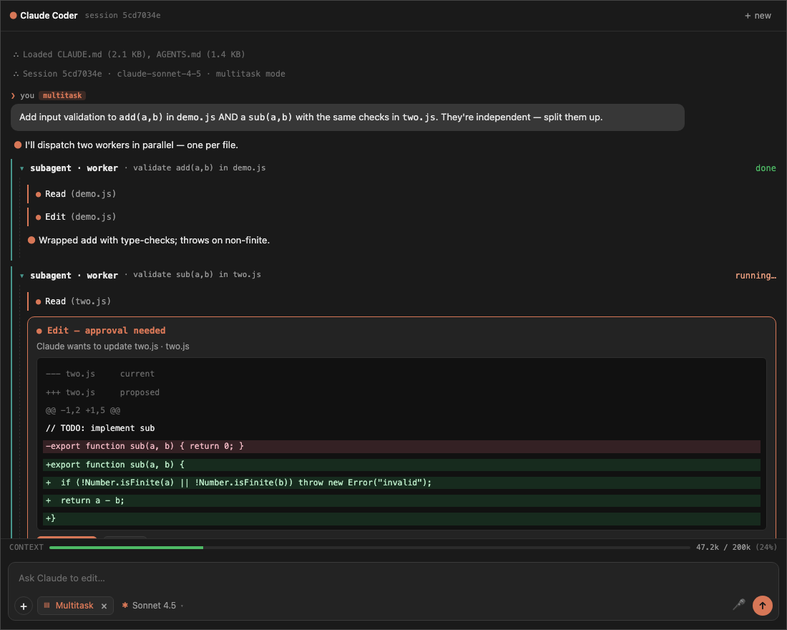

# Claude Coder

A VS Code extension that brings agentic coding to the editor, powered by the
official [Claude Agent SDK](https://code.claude.com/docs/en/agent-sdk/overview).
Cursor-style chat experience: 5-mode switcher (`Plan` / `Debug` / `Multitask` /
`Ask` / `Agent`), parallel subagents, live context-window indicator, and
auto-loaded project memory (`CLAUDE.md` / `AGENTS.md` / `.cursorrules`).



## What it does

- **Sidebar chat** in its own activity bar container, with the Cursor composer
  layout: a `+` menu, a removable mode pill, an inline model selector, a mic
  placeholder, and a round Claude-orange send button.
- **5 modes** — tap `+` to switch:
  - **Plan** — read-only exploration; the agent produces a numbered plan and
    refuses to call `Edit` / `Write` / `Bash` until you switch to Agent.
  - **Debug** — hypothesis-driven loop: form a hypothesis, run a verifying
    experiment, cite the runtime evidence, refine.
  - **Multitask** — the main agent dispatches independent sub-tasks in
    parallel via the SDK `Agent` tool with a `worker` subagent definition;
    nested messages render under their parent's "subagent · worker" block.
  - **Ask** — read-only Q&A; no plans, no edits.
  - **Agent** — the default; full toolset, edits gated by approval.
- **Streams** `assistant`, `tool_use`, and `tool_result` events from the SDK
  in real time. Subagent traffic is keyed by `parent_tool_use_id` so parallel
  workers never collapse into each other.
- **Approval-gated tools** — `Edit` / `Write` / `Bash` route through a
  `canUseTool` round-trip with a unified diff preview and Allow / Deny dialog.
  Read-only tools (`Read` / `Glob` / `Grep` / `WebSearch` / `WebFetch` /
  `TodoWrite`) are pre-approved by default.
- **Live context indicator** — a thin bar above the composer shows
  `47.2k / 200k (24%)` with an input/output/cache breakdown on click. Color
  bands turn amber at 60% and red at 85%.
- **`CLAUDE.md` / `AGENTS.md` / `.cursorrules`** are read from the workspace
  root on every turn (truncated to 8 KB each) and appended to the system
  prompt — Claude can "look at the codebase carefully" before editing.
- **`@`-mention** workspace files via `vscode.workspace.findFiles`.
- **Slash commands**: `/help`, `/clear`, `/new`, `/resume`, `/cost`, `/model`.
- **Per-workspace session resume** — `session_id` persisted in
  `workspaceState`; `New Session` clears it.
- **Stop button** wired to an `AbortController` passed into `query()`.
- **API key in `vscode.SecretStorage`** — never written to disk in plain text.

## Install (from the .vsix)

```bash
# In VS Code or Cursor:
code --install-extension claude-coder-0.0.2.vsix
# Or: Command Palette → "Extensions: Install from VSIX…" → pick the file.
```

The packaged `.vsix` lives at the project root (`claude-coder-0.0.2.vsix`).

## First run

1. Click the Claude Coder icon in the activity bar.
2. The empty-state shows **Set Anthropic API Key…** — click it (or run
   `Claude Coder: Set Anthropic API Key…` from the command palette).
3. Paste your `sk-ant-…` key. It is stored in VS Code's `SecretStorage`.
4. (Optional) drop a `CLAUDE.md` in your repo root to ground the agent.
5. Type a prompt and press <kbd>Enter</kbd>. Try:
   - Default Agent mode: `read package.json and tell me what scripts are defined`
   - Switch to Plan: `Plan how to add a --verbose flag to src/main.ts`
   - Switch to Multitask: `Add JSDoc to add() in demo.js AND sub() in two.js — they're independent, split them up`
   - `@README.md what's missing in this doc?`

When Claude proposes an `Edit` or `Write`, you'll see a diff preview with
**Allow once** / **Deny…** buttons. Bash commands show the exact command
to be run.

## Modes — quick reference

| Mode | Tools | Pre-approved | Notable behavior |
|------|-------|--------------|------------------|
| Agent | `Read` `Write` `Edit` `Bash` `Glob` `Grep` `WebSearch` `WebFetch` `TodoWrite` | read-only set | Default. Edits gated by approval. |
| Plan | `Read` `Glob` `Grep` `WebSearch` `WebFetch` `TodoWrite` | all tools (no approval) | System prompt forbids `Edit`/`Write`/`Bash`. |
| Ask | (same as Plan) | all tools | "Just answer." No plans, no tasks. |
| Multitask | (Agent) + `Agent` tool with `worker` subagent | read-only + `Agent` | Dispatches workers in parallel; nested view by `parent_tool_use_id`. |
| Debug | (Agent set) | read-only set | Scientific-method system prompt. |

## Develop

Requirements: Node 18+, npm, VS Code 1.92+.

```bash
cd claude-coder
npm install
npm run build      # builds dist/extension.js + webview-ui/dist
```

Then either:

- Open this folder in VS Code and press <kbd>F5</kbd> to launch the
  Extension Development Host.
- Or run from CLI:
  ```bash
  code --extensionDevelopmentPath=$(pwd)
  ```

A `.vscode/launch.json` is included that runs `npm: build` as a pre-launch
task and points at `dist/extension.js`.

### Useful scripts

| Script | What it does |
|--------|-------------|
| `npm run build` | Build extension (esbuild) + webview (Vite) |
| `npm run watch:extension` | Rebuild `dist/extension.js` on save |
| `npm run watch:webview` | Rebuild webview on save |
| `npm run typecheck` | `tsc --noEmit` for both projects |
| `npm run package` | Build + `vsce package` → `claude-coder-0.0.2.vsix` |

### SDK smoke tests

Verify your API key + SDK install end-to-end without launching the editor:

```bash
ANTHROPIC_API_KEY=sk-ant-... node scripts/e2e-runner-smoke.mjs --mode=agent
ANTHROPIC_API_KEY=sk-ant-... node scripts/e2e-runner-smoke.mjs --mode=plan
ANTHROPIC_API_KEY=sk-ant-... node scripts/e2e-runner-smoke.mjs --mode=ask
ANTHROPIC_API_KEY=sk-ant-... node scripts/e2e-runner-smoke.mjs --mode=multitask
```

- `--mode=agent` does Read + Edit on a temp file and asserts the file changed.
- `--mode=plan` and `--mode=ask` assert NO `Edit`/`Write`/`Bash` were called
  and the file is unchanged.
- `--mode=multitask` asserts ≥1 `Agent` tool dispatch and that nested
  messages carry `parent_tool_use_id`.

Cost: ~$0.02–0.12 per run.

## Settings

| Setting | Default | Description |
|---------|---------|-------------|
| `claudeCoder.model` | `claude-sonnet-4-5` | Model to use |
| `claudeCoder.maxTurns` | `50` | Max agent turns per query |
| `claudeCoder.permissionMode` | `default` | `default` (canUseTool prompts), `acceptEdits` (auto-accept file edits), `bypassPermissions` (no prompts) |
| `claudeCoder.systemPromptOverride` | `""` | Optional custom system prompt — when set, it replaces (rather than augments) the per-mode prompt |
| `claudeCoder.allowedTools` | `["Read","Write","Edit","Bash","Glob","Grep","WebSearch","WebFetch"]` | Tools the agent can call (intersected with the active mode's tool set) |

## Commands

- `Claude Coder: Focus Chat` — <kbd>⌘L</kbd> / <kbd>Ctrl+L</kbd>
- `Claude Coder: New Session` — clears the saved `session_id`
- `Claude Coder: Set Anthropic API Key…` — store key in `SecretStorage`
- `Claude Coder: Clear Anthropic API Key`
- `Claude Coder: Stop` — abort the in-flight agent run

## Architecture

```
extension host (Node)                       webview (React + Vite)
─────────────────────                       ──────────────────────
extension.ts                                App.tsx
  └─ ChatViewProvider                         ├─ Composer (+ menu, mode pill,
       ├─ AgentRunner ─→ Agent SDK            │             model, mic, send)
       │    ├─ modes.ts (Agent/Plan/Ask/      ├─ ModePicker popover
       │    │              Multitask/Debug)   ├─ ContextBar (% indicator)
       │    ├─ contextLoader (CLAUDE.md…)     ├─ SubagentWorkstream (nested
       │    ├─ tokenTracker (usage→ctxBar)    │    by parent_tool_use_id)
       │    ├─ ToolApprovalBridge ─⇆─→  ApprovalDialog + DiffPreview
       │    └─ SessionStore                   └─ ToolUseBlock
       └─ SecretsStore                        (markdown render via marked)
```

The two sides share the typed message protocol in
[`src/util/messages.ts`](./src/util/messages.ts) — re-imported by the webview
via a relative path so a single source of truth defines every message.

## Notes / known limitations

- The SDK ships an embedded `claude` runtime (~200 MB) so the packaged
  `.vsix` is ~62 MB.
- Multi-agent: workers stream in parallel and the UI keys them by
  `parent_tool_use_id` so output never bleeds between workers. They do **not**
  share the parent's context — pass each worker a self-contained prompt.
- Mic is a placeholder (disabled, "coming soon"). Image attachment, Models /
  Skills / MCP Servers menu items in the `+` menu are placeholders for the
  next iteration.
- Mode-switch mid-session: only the next turn's options change. The session
  is preserved (resume keeps history).
- Webview syntax highlighting is intentionally minimal (no Shiki) to keep
  the bundle small — markdown code blocks render as plain mono text.

## License

MIT.
